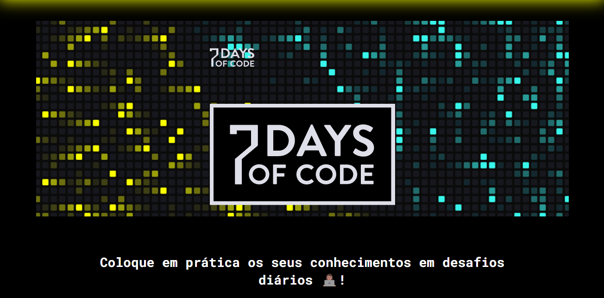

# 👨‍💻 7 DAYS OF CODE ALURA

## 🎯 Proposta

"A prática leva à perfeição", é relacionado a isso que se trata o projeto [7DaysOfCode](https://7daysofcode.io).
Durante 7 dias haverão tarefas diárias a se cumprir sobre uma daterminada tecnologia a fim de se desenvolver o hábito do estudo contínuo e avanço progressivo.

> Visualização da página inicial do site.

## 🚀 Edições

Tema | Descrição | Status
|---|---|---
[Lógica com Javascript](desafios/logicaJavaScript) | Durante os 7 desafios você vai praticar com a linguagem mais usada no mundo e aprenderá como usar o Javascript para criar algoritmos e resolver problemas do seu dia-a-dia. Vamos ver como usar variáveis, condicionais e estruturas de loop para resolver problemas que são a base que qualquer pessoa entrando na área da programação precisa conhecer | Concluído
[GitHub](https://github.com/LucasHenrique-dev/Semana-GitHub-Alura) | Durante os 7 Days de GitHub, você vai praticar algo que além de importantíssimo, será muito divertido. Você irá criar, do zero, um repositório no GitHub usando um template. Posteriormente, você irá começar a fazer requisições para esse repositório, tanto manualmente quanto através da IDE do Visual Studio Code. Você irá trabalhar com muitos conceitos que colocarão à prova os seus conhecimentos de GitHub | Em Andamento

## ☕ Conhecendo mais

Para acessar a página dos desafios acesse: [7DaysOfCode](https://7daysofcode.io)

Para conhecer mais sobre a Alura acesse: [Alura](https://www.alura.com.br)

[⬆ Voltar ao topo](#-7-days-of-code-alura)
